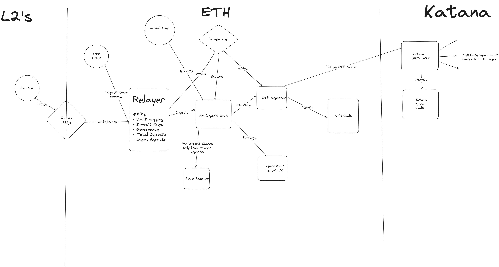

# Katana Pre Deposit Vaults



NOTE: The live versions `stbDepositor` mapping will not necessarily be accurate in the Deposit Relayer. Retrieve the current vault strategies using `vault.get_default_queue()`

## How to start

### Requirements

- First you will need to install [Foundry](https://book.getfoundry.sh/getting-started/installation).
NOTE: If you are on a windows machine it is recommended to use [WSL](https://learn.microsoft.com/en-us/windows/wsl/install)
- Install [Node.js](https://nodejs.org/en/download/package-manager/)

### Build the project

```sh
make build
```

Run tests

```sh
make test
```

Run tests with traces (very useful)

```sh
make trace
```

Run specific test contract (e.g. `test/StrategyOperation.t.sol`)

```sh
make test-contract contract=StrategyOperationsTest
```

Run specific test contract with traces (e.g. `test/StrategyOperation.t.sol`)

```sh
make trace-contract contract=StrategyOperationsTest
```

See here for some tips on testing [`Testing Tips`](https://book.getfoundry.sh/forge/tests.html)

When testing on chains other than mainnet you will need to make sure a valid `CHAIN_RPC_URL` for that chain is set in your .env. You will then need to simply adjust the variable that RPC_URL is set to in the Makefile to match your chain.

To update to a new API version of the TokenizeStrategy you will need to simply remove and reinstall the dependency.

### Test Coverage

Run the following command to generate a test coverage:

```sh
make coverage
```

To generate test coverage report in HTML, you need to have installed [`lcov`](https://github.com/linux-test-project/lcov) and run:

```sh
make coverage-html
```

The generated report will be in `coverage-report/index.html`.

## CI

This repo uses [GitHub Actions](.github/workflows) for CI. There are three workflows: lint, test and slither for static analysis.

To enable test workflow you need to add the `ETH_RPC_URL` secret to your repo. For more info see [GitHub Actions docs](https://docs.github.com/en/codespaces/managing-codespaces-for-your-organization/managing-encrypted-secrets-for-your-repository-and-organization-for-github-codespaces#adding-secrets-for-a-repository).

If the slither finds some issues that you want to suppress, before the issue add comment: `//slither-disable-next-line DETECTOR_NAME`. For more info about detectors see [Slither docs](https://github.com/crytic/slither/wiki/Detector-Documentation).

### Coverage

If you want to use [`coverage.yml`](.github/workflows/coverage.yml) workflow on other chains than mainnet, you need to add the additional `CHAIN_RPC_URL` secret.

Coverage workflow will generate coverage summary and attach it to PR as a comment. To enable this feature you need to add the [`GH_TOKEN`](.github/workflows/coverage.yml#L53) secret to your Github repo. Token must have permission to "Read and Write access to pull requests". To generate token go to [Github settings page](https://github.com/settings/tokens?type=beta). For more info see [GitHub Access Tokens](https://docs.github.com/en/authentication/keeping-your-account-and-data-secure/managing-your-personal-access-tokens).
